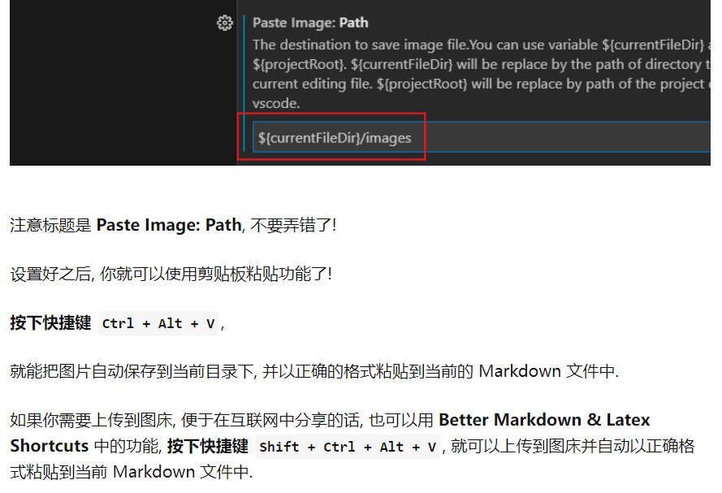

# 一级标题 

一级标题
=======

## 二级标题

二级标题
-------

### 三级标题

---

普通字体

**重点加粗**

*斜体*

~~删除线~~

==高亮==

---
列表:

* 无序列表
  * 嵌套无序列表
  * 2级
    * 3级
      * 4级
        * 5级
* 无序列表
* 无序列表

任务列表:

- [x] 已经完成的事 1
- [x] 已经完成的事 2
- [x] 已经完成的事 3
- [ ] 仍未完成的事 4
- [ ] 仍未完成的事 5

1. 有序列表 1
   1. 嵌套有序列表 1
   2. aaa
      1. 嵌套有序列表 2
      2. aa
         1. a
         2. b
2. 有序列表 2
3. 有序列表 3

---

引用文本:

> 引用别人说的话
> 就这样写
> By. OrangeX4

> 换行再引用

---

这是 `行内代码` 语法.

代码块语法:

``` python{.line-numbers}
print("Hello, World!")
```

`SELECT a FROM b INNER JOIN c ON b.d = c.e WHERE f = 1 AND g IS NULL` 

``` sql{.line-numbers}
SELECT a 
FROM b INNER JOIN c ON b.d = c.e 
WHERE b.f = 1 AND c.g IS NULL
```
---

[超链接名称](https://pyecharts.org/#/zh-cn/quickstart)


---

表格:

| 表头1 | 表头2 |
| ----- | ----- |
| 内容1 | 内容2 |
| 内容1 | 内容2 |


---

注释:

<!-- 你看不见我 -->

VSCode 会在你每次修改代码之后, 重新渲染一遍.

如果有很多很多的数学公式, 渲染会很慢, 这时候有两个建议:

分成多个文件, 避免单文件过大!
将你暂时不看的部分注释掉, 加快渲染速度!

---

直接粘贴图片：ctrl+alt+v



---

行内公式: 

单位圆 $x^2+y^2=1$

公式块:

$$
\begin{cases}
x=\rho\cos\theta \\
y=\rho\sin\theta \\
\end{cases}
$$

上标和下标
$x^{12} + x_{12}$


分式

较小的行内行分数 $\frac{1}{2}$

展示型的分式 $\displaystyle\frac{x+1}{x-1}$

根式
开平方 $\sqrt{2}$

开 $n$ 次方 $\sqrt[n]{2}$

空格
数学公式中的空格和换行都会在编译时被忽略.

输入空格:
紧贴 $a\!b$
没有空格 $ab$
小空格 $a\,b$
中等空格 $a\;b$
大空格 $a\ b$
quad 空格 $a\quad b$
两个 quad 空格 $a\qquad b$

累加, 累乘和积分
累加 $\sum_{k=1}^n\frac{1}{k}  \quad  \displaystyle\sum_{k=1}^n\frac{1}{k}$

累乘 $\prod_{k=1}^n\frac{1}{k}  \quad  \displaystyle\prod_{k=1}^n\frac{1}{k}$

积分 $\displaystyle \int_0^1x{\rm d}x  \quad  \iint_{D_{xy}}  \quad  \iiint_{\Omega_{xyz}}$


括号修饰
用 \left 和 \right 可以让括号适配内部大小
圆括号 $\displaystyle \left(\sum_{k=1}^{n}\frac{1}{k} \right)^2$

方括号 $\displaystyle \left[\sum_{k=1}^{n}\frac{1}{k} \right]^2$

花括号 $\displaystyle \left\{\sum_{k=1}^{n}\frac{1}{k} \right\}^2$

尖括号 $\displaystyle \left\langle\sum_{k=1}^{n}\frac{1}{k} \right\rangle^2$

# 更多Latex用法：
[知乎专栏](https://zhuanlan.zhihu.com/p/366596107)


asdasd
asdas
asdasd
asdasd
asdasd
asdasd
asdasd
asdasdas
adssd

# git提交
